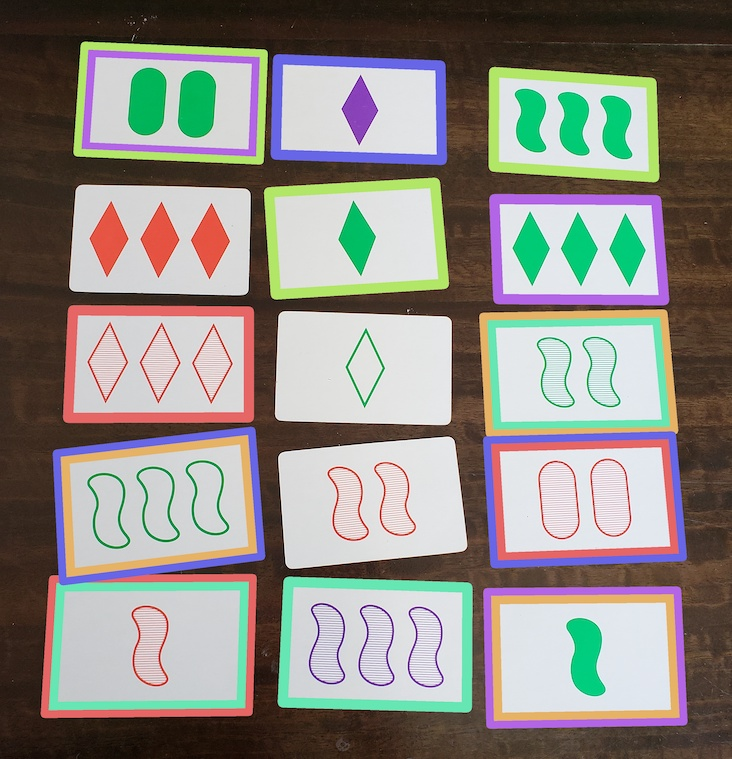

# set-solver
Solve the SET card game using OpenCV. Image of a game of set -> same image with labeled sets. Under construction.



## Setup

### 1. Install OpenCV

Mac: [Use this guide](https://www.pyimagesearch.com/2016/12/19/install-opencv-3-on-macos-with-homebrew-the-easy-way/)

Linux: ??? (`#TODO`)

### 2. Install python libraries: 

```
pip install -r requirements.txt
```

Or use a `virtualenv` if you don't want to clutter your global packages

```
python -m virtualenv venv
source venv/bin/activate
pip install -r requirements.txt
```

### 3. Solve SET!

To solve a game and display the image with boxes around the sets:

```
./solve_set.py [filename] --display
```

#### Full usage:
```
usage: solve_set.py [-h] [--game GAME_NUM] [--write] [--display] [filename]

Solve SET from a game image.

positional arguments:
  filename         Game image filename

optional arguments:
  -h, --help       show this help message and exit
  --game GAME_NUM  use a test image from image-data/set-
                   games/setgame<GAME_NUM>.jpg
  --write          Write the solved image to solve-out/solved.jpg
  --display        Display the solved image with cv2.display()
```

## Files

* `image-data/` - All image data, including raw game images, labeled card images.
* `vendor/` - where the [Noteshrink](https://mzucker.github.io/2016/09/20/noteshrink.html) code (for color bucketing) lives.
* `avg_colors.py` - Single use script to get the average shape color values from each of the red, green, purple images.
* `card_finder.py` - Given a game image, outputs images of all cards found.
* `classes.py` - Classes representing set games and cards.
* `classify_card.py` - Given a card image, outputs the best guess of what card it is.
* `classify_card_accuracy.py` - Rate how well `classify_card.py` does against a directory of labeled card files.
* `common.py` - Common constants or functions shared between scripts.
* `cv2_diff.py` - The same functionality as [diffimg](https://github.com/nicolashahn/diffimg), but implemented using `cv2` instead of `PIL`. Gives different ratios and I still need to investigate why. Also runs much slower.
* `process_card.py` - Process a card image so that it's more easily classified by `classify_card.py`.
* `extract_shapes.py` - Cut out one to three shapes from a card image.
* `label_all_cards.py` - Single use script to easily label cards.
* `solve_set.py` - Script that runs the whole pipeline - takes in a game image file and displays that image with the sets overlaid.
* `test.py` - Tests for each chunk of the pipeline.

## Future tasks

- [ ] Increase card classification accuracy
  - [ ] "Shove a neural net into it" - optional if OpenCV isn't enough (probably not necessary, but could be fun)
    - [ ] I don't want to take hundreds of pictures of cards, so maybe fake a training set? Take the same image and artificially introduce jitter in a variety of ways (position, skew, rotation, white balance, lighting, etc) that mimics the real differences we'd get
- [ ] Better than brute force way to solve SET? Might be interesting to think about if SET's # cards on table, # attributes, # categories per attribute were increased
- [ ] More tests in general
- [ ] Make it run on a phone
  - [ ] React Native app that sends an image to a Flask app?
  - [ ] Have the whole pipeline run on the phone? Going to require an entire rewrite of the pipeline
